# Michimuri Themes for Qtile
Some color themes for @antoniosarosi Qtile build
___

# Preview:

## Afternoon Coffee

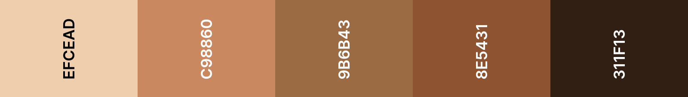

## Baby Dream
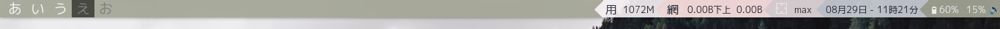
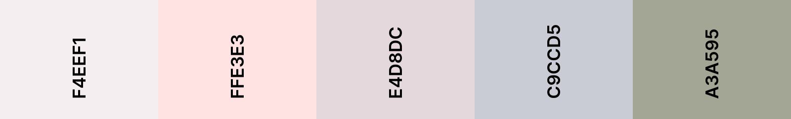

## Dare no wardrobe
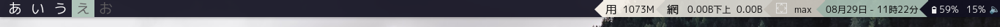
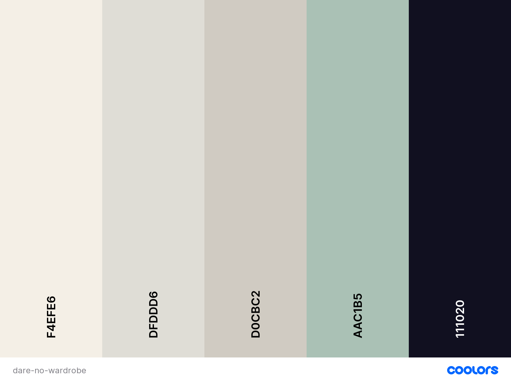

## Kobayashi
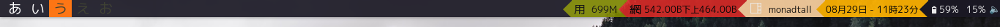
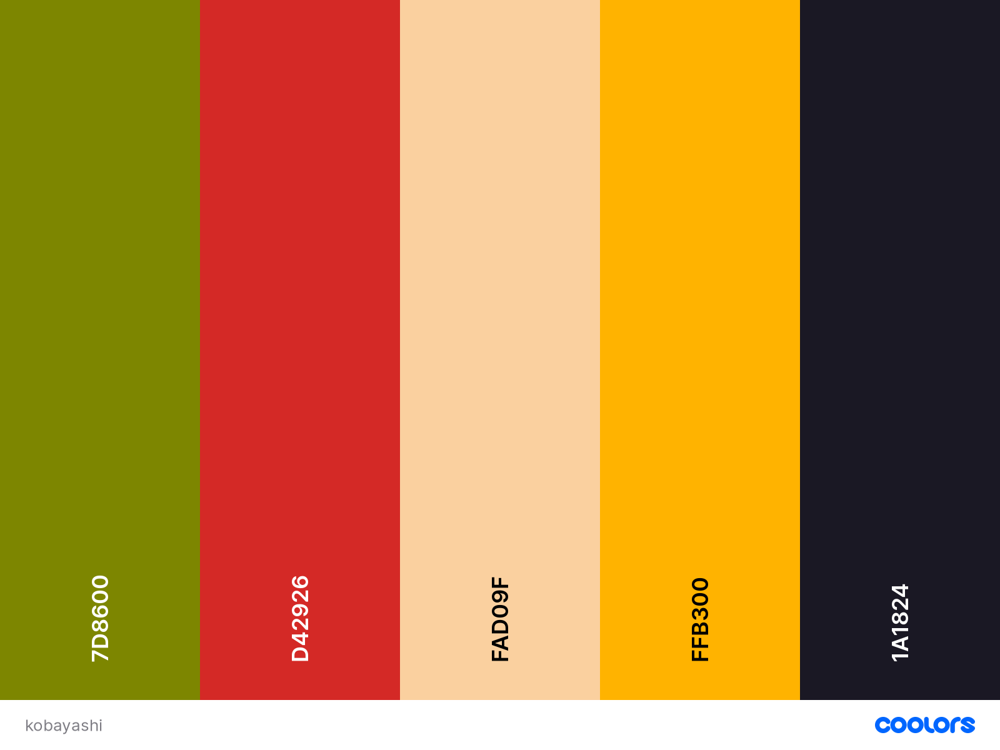

## Marsella
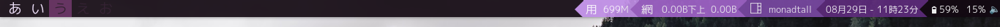
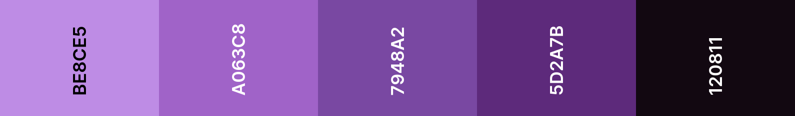

## Nemuri
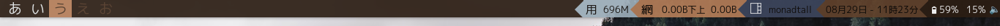
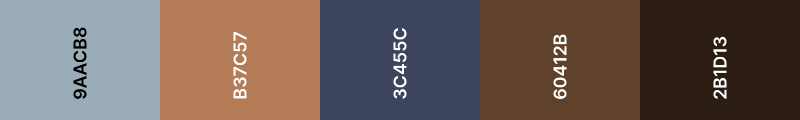

## Nuna-noon
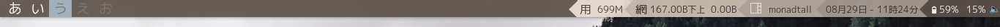
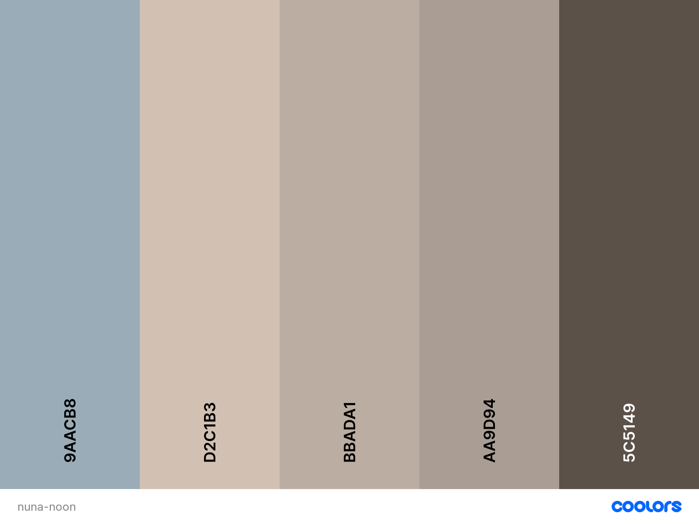

## Softpastel
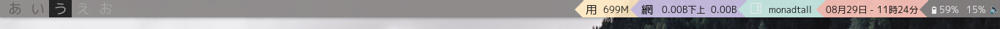
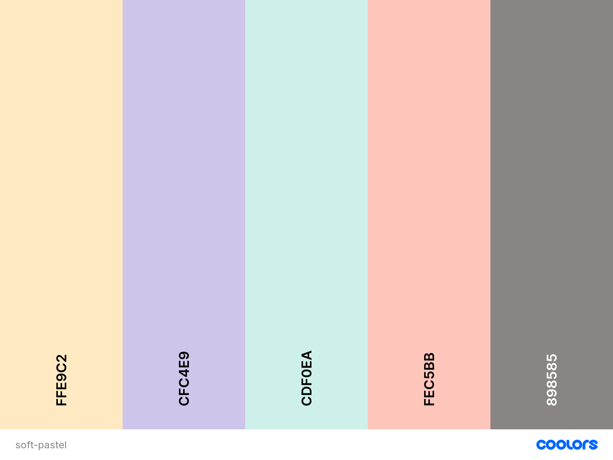

## Vaporday
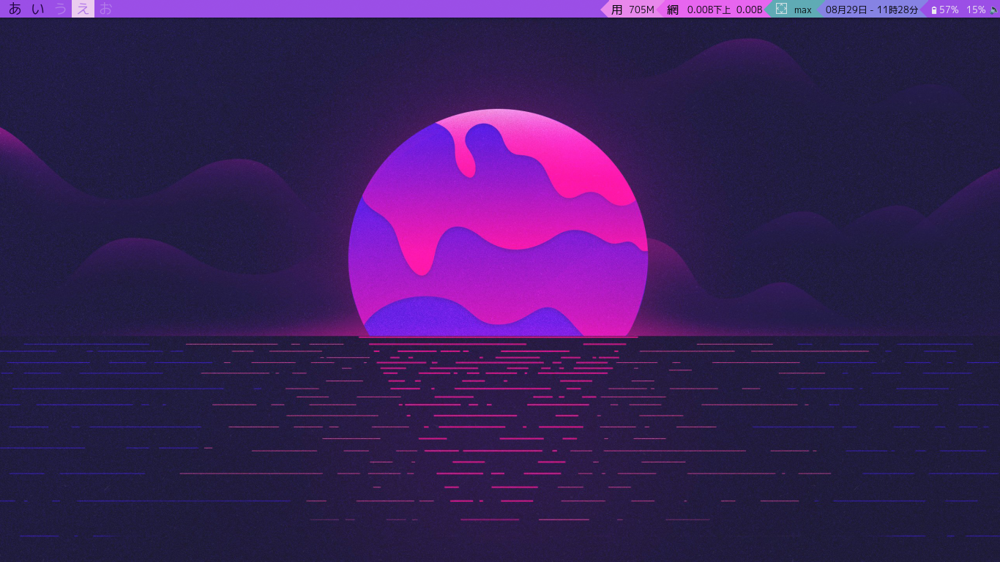
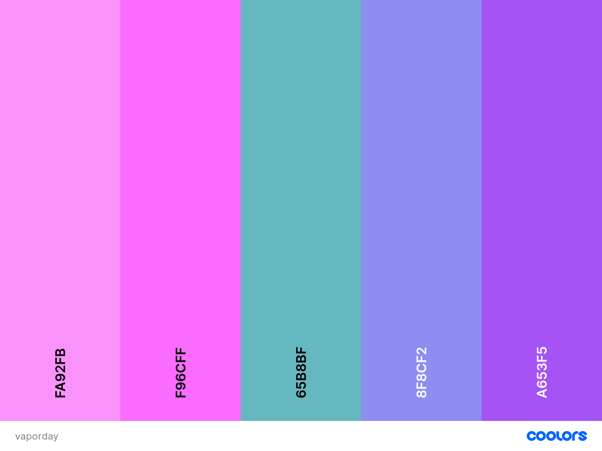

# Installation
`git clone https://github.com/Michimuri/qtile-themes.git`

Or just copy the colors, since these themes are just JSON files.
