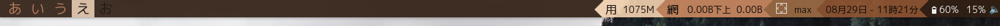
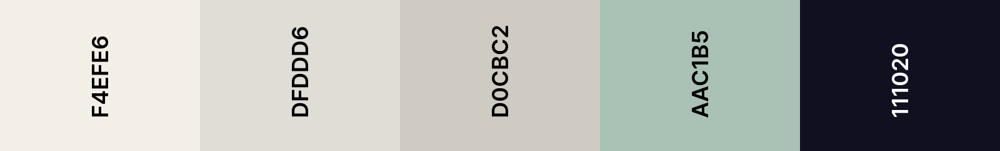
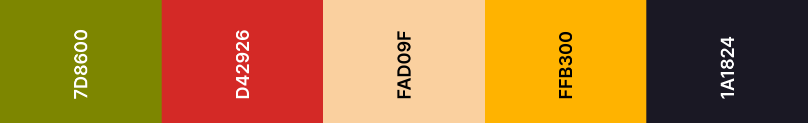
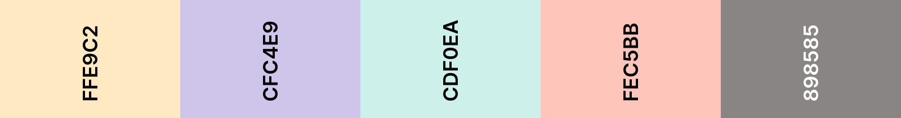
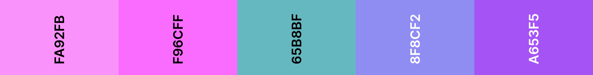

# Michimuri Themes for Qtile
Some color themes for @antoniosarosi Qtile build
___

# Preview:

## Afternoon Coffee

## Baby Dream

## Dare no wardrobe

## Kobayashi

## Marsella

## Nemuri

## Nuna-noon

## Softpastel

## Vaporday

# Installation
`git clone https://github.com/Michimuri/qtile-themes.git`

Or just copy the colors, since these themes are just JSON files.
